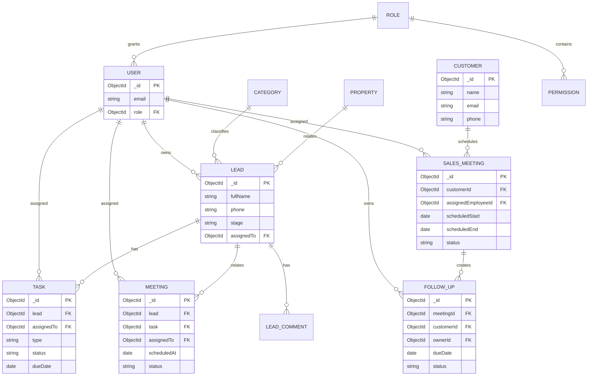

# Sales CRM

Sales CRM is a React/Vite frontend and Node.js/Express backend for managing leads, customers, property sales activity, meetings, tasks, follow-ups, users, roles, permissions, and notifications.

```text
crm/                                           React frontend
sales_crm_backend_w-production/
  sales_crm_backend_w-production/              Express backend
```

## Requirements

- Node.js 20 or newer
- npm 10 or newer
- MongoDB, local or hosted
- Redis for cache/socket features in a production-like environment
- Firebase credentials when push notifications are enabled

## Setup

### Backend

```bash
cd sales_crm_backend_w-production/sales_crm_backend_w-production
npm install
```

Create `.env` in the backend directory. At minimum:

```env
MONGO_URI=mongodb://127.0.0.1:27017/sales_crm
PORT=5000
```

The application also reads environment variables for JWT, Redis, CORS, Firebase, email, and third-party integrations. Check `src/config`, `src/utils`, and the deployment environment for the complete set used by enabled features.

```bash
npm run migrate
npm run dev
# or
npm start
```

The API health endpoint is `GET http://localhost:5000/`.

### Frontend

```bash
cd crm
npm install
npm run dev
```

Vite prints the frontend URL, normally `http://localhost:5173`. Configure the frontend API base URL using the convention already used in `src/config.js` before connecting it to a non-local backend.

## Architecture Overview

The frontend is a Vite React application. `src/App.jsx` composes the application and `src/views` contains layouts, pages, and shared UI components. API calls are grouped in `src/api-hooks`, while `src/hooks`, `src/store`, and `src/socket-management` provide reusable client state, notifications, and realtime updates.

The backend is an Express application organized by feature under `src/modules`. Modules generally contain routes, controllers, services, validation, and a Mongoose model. `src/app.js` applies CORS, Helmet, logging, rate limiting, activity logging, JSON parsing, static files, webhooks, module routes, and the global error handler. `src/modules/index.js` mounts module route groups under `/api` and applies authentication to private groups. Scheduled jobs live under `src/modules/cron`.

```text
Browser -> React/Vite -> REST API (/api) -> Express middleware
                                      -> module route
                                      -> controller -> service -> Mongoose/MongoDB
                                      -> Socket.IO / Redis / external providers
```

## Database Model

MongoDB is accessed through Mongoose. Most entities use the shared `BaseModel`, which adds timestamps, audit users, soft deletion, versioning, pagination, and a default filter that hides deleted records.



This is a relationship overview rather than a generated schema dump. Supporting collections include comments, reminders, notifications, sessions, categories, properties, legal documents, batch uploads, system activity, scoring records, and integration data. References are application-level Mongoose `ObjectId` references; MongoDB does not enforce foreign keys.

## API Documentation

The API base path is `/api`. Except for authentication, public legal content, and webhooks, route groups are mounted behind authentication and usually require a permission such as `lead:read` or `task:create`.

For the concrete endpoint reference, request examples, validation rules, permissions, and response conventions, see [docs/API.md](../docs/API.md).

### Public and authentication endpoints

| Method | Endpoint | Purpose |
| --- | --- | --- |
| GET | `/` | Backend health check |
| POST | `/api/auth/login` | Authenticate a user |
| POST | `/api/auth/logout` | End a session |
| POST | `/api/auth/validate` | Validate a token |
| GET | `/api/legal/public/:type` | Read public legal content |
| GET/POST | `/api/webhook/facebook` | Verify or receive Facebook events |
| POST | `/api/lead/webhooks/leads` | Ingest an external lead |

### Resource endpoint groups

| Prefix | Main operations |
| --- | --- |
| `/api/lead` | Create, list, search, export, summarize, update, assign, change stage, comments, duplicates, import, lock/unlock, archive/restore |
| `/api/customer` | List, get, create, update, delete customers |
| `/api/task` | Create, list, update, complete, soft-delete, constants |
| `/api/meeting` | Create, update, cancel, list upcoming meetings |
| `/api/sales-meeting` | List/get, create/update, confirm, check-in, start, check-out, complete, cancel, reopen, stats |
| `/api/follow-up` | List/get, create/update, delete, complete follow-ups |
| `/api/reminders` | Create, list, get, update, complete, delete reminders |
| `/api/category` | Create, list, dropdown, get, update, toggle, restore, delete |
| `/api/property` | Create, list, get, update, toggle, soft-delete, hard-delete |
| `/api/user` | Create, list, search, hierarchy, permissions, parent changes, update, password, delete, restore |
| `/api/role` | Create, list, get, update, delete, restore, dropdown |
| `/api/permission` | Fetch and update permissions |
| `/api/salesperson` | Salesperson performance |

The module route files are the authoritative contract for exact request bodies, query parameters, permission names, and response shapes.

## Automated Tests

The backend uses Node's built-in test runner and tests the existing Joi validation contracts without requiring MongoDB, Redis, or external services:

```bash
cd sales_crm_backend_w-production/sales_crm_backend_w-production
npm test
```

The suite covers seven rules: required lead identity, controlled lead sources/tags, valid lead stages and assignments, task type and due date, task lifecycle status, customer name/email/coordinate validation, and follow-up identifiers/title/due date.

## Decisions & Trade-offs

- MongoDB and Mongoose were retained because the existing application already models flexible CRM records with ObjectId references, indexes, and soft deletion.
- The ER diagram is a readable relationship overview; the module models remain the source of truth.
- Tests target pure Joi validation for speed and determinism. Production should add API-level tests with isolated MongoDB, authorization tests, and integration tests for Redis, sockets, webhooks, and cron jobs.
- The current server starts database, cache, socket, and cron behavior during startup. Production should separate app construction from infrastructure startup, add readiness checks, and use graceful shutdown.
- Production hardening should include secret management, strict environment validation, migration rollback support, request/response schemas, structured errors, observability, backups, and CI enforcement for linting and tests.
- MongoDB references are not foreign keys. Production workflows should add consistency checks and transactions where assignment, audit history, notifications, and related records must change atomically.
